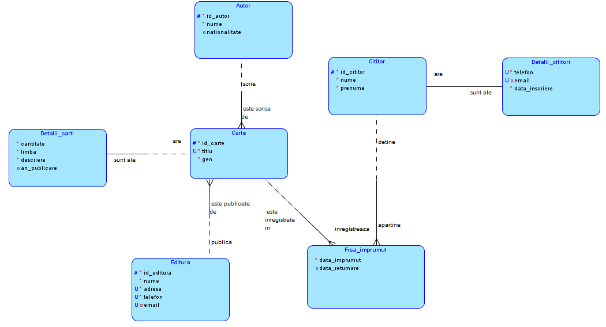
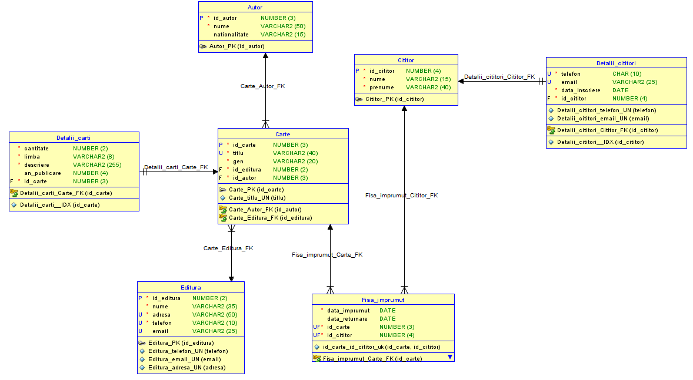

# Database-project
## The requirement of this project is as follows:
This project involves designing a database system using relational databases and SQL. The objectives include formulating the problem, creating an Entity-Relationship diagram, documenting the design process, and testing the model with scripts. The database must have at least six tables with one-to-one and one-to-many relationships, and optionally many-to-many relationships. It should utilize primary and foreign keys, CHECK, UNIQUE, and NOT NULL constraints, and validate input data.
## Library Database Management System
This is an SQL database project for managing a library, allowing the organization of books by genres, authors, and publishers, as well as managing readers and loans. The application adheres to strict rules for borrowing books and manages reader details, enforcing the uniqueness of email addresses and phone numbers.

The database is structured into seven main entities:

CARTE (BOOK): Stores information about available books (id_book, title, genre, id_author, id_editura).

DETALII_CARTI (BOOK_DETAILS): Contains additional details about books (quantity, language, description, year_published, id_carte).

AUTOR (AUTHOR): Stores information about the authors of the books (id_author, name, nationality).

EDITURA (PUBLISHER): Stores information about the publishers from which the books come (id_publisher, name, address, phone, email).

CITITOR (READER): Stores information about readers (id_reader, name, surname).

DETALII_CITITORI (READER_DETAILS): Contains additional information about readers (phone, email, date_of_registration, id_cititor).

FISA_IMPRUMUT (LOAN_RECORD): Keeps track of loans (date_of_loan, date_of_return, id_cititor, id_carte).

The project also includes details about the structure and inter-relationship of the tables, the logical model, normalization of the tables (1NF, 2NF, 3NF), the relational model, and the constraints applied (PRIMARY KEY, FOREIGN KEY, UNIQUE KEY, NOT NULL, CHECK).

